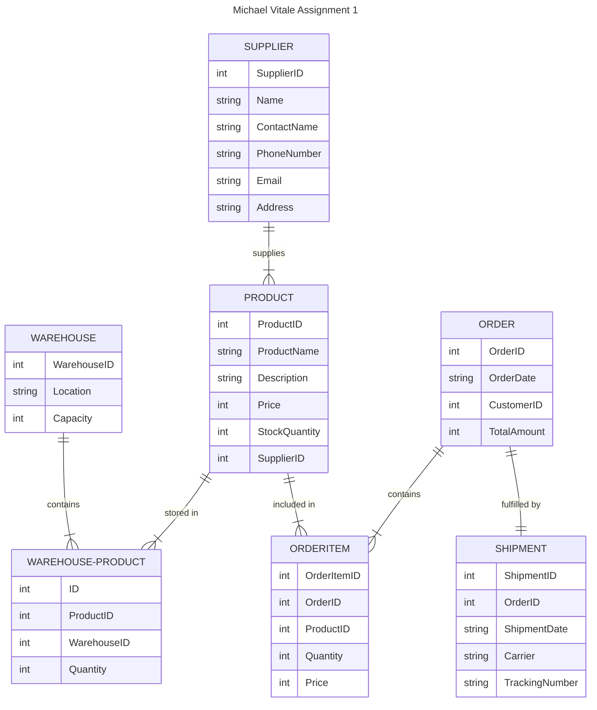

```mermaid
---
title: Michael Vitale Assignment 1
---
erDiagram
	SUPPLIER {
		int SupplierID
		string Name
		string ContactName
		string PhoneNumber
		string Email
		string Address
	}
	PRODUCT {
		int ProductID
		string ProductName
		string Description
		int Price
		int StockQuantity
		int SupplierID
	}
	WAREHOUSE {
		int WarehouseID
		string Location
		int Capacity
	}
	WAREHOUSE-PRODUCT {
		int ID
		int ProductID
		int WarehouseID
		int Quantity
	}
	ORDER {
		int OrderID
		string OrderDate
		int CustomerID
		int TotalAmount
	}
	ORDERITEM {
		int OrderItemID
		int OrderID
		int ProductID
		int Quantity
		int Price
	}
	SHIPMENT {
		int ShipmentID
		int OrderID
		string ShipmentDate
		string Carrier
		string TrackingNumber
	}

	SUPPLIER ||--|{ PRODUCT : supplies
	WAREHOUSE ||--|{ WAREHOUSE-PRODUCT : contains
	PRODUCT ||--|{ WAREHOUSE-PRODUCT : "stored in"
	PRODUCT ||--|{ ORDERITEM : "included in"
	ORDER ||--|{ ORDERITEM : contains
	ORDER ||--|| SHIPMENT : "fulfilled by"
```

