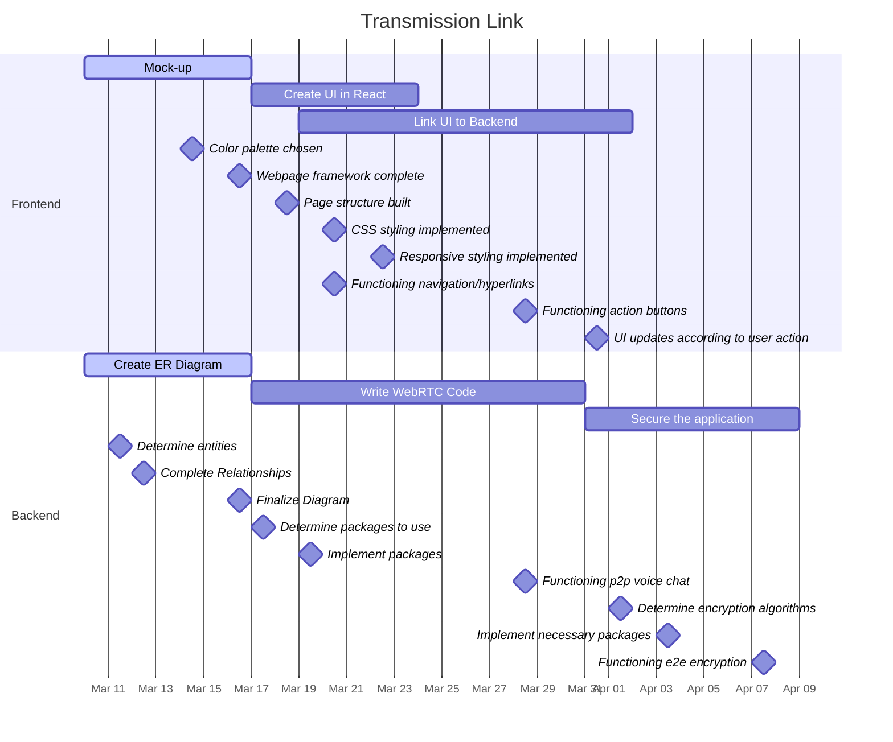

```mermaid
gantt
	title Transmission Link
	dateFormat YYYY-MM-DD
	axisFormat %b %d

	section Frontend
	Mock-up : active, f1, 2025-03-10, 7d
	Create UI in React : f2, after f1, 7d
	Link UI to Backend : f3, 2025-03-19, 14d
	%% Mock-up Milestones
	Color palette chosen :milestone, mf2, 2025-03-14, 1d
	Webpage framework complete :milestone, mf1, 2025-03-16, 1d
	%% UI Milestones
	Page structure built :milestone, mf3, 2025-03-18, 1d
	CSS styling implemented :milestone, mf4, 2025-03-20, 1d
	Responsive styling implemented :milestone, mf5, 2025-03-22, 1d
	%% Linking Milestones
	Functioning navigation/hyperlinks :milestone, mf6, 2025-03-20, 1d
	Functioning action buttons :milestone, mf7, 2025-03-28, 1d
	UI updates according to user action :milestone, mf8, 2025-03-31, 1d
	
	section Backend
	Create ER Diagram : active, b1, 2025-03-10, 7d
	Write WebRTC Code : b2, after b1, 14d
	Secure the application : b3, after b2, 9d
	%% ERD Milestones
	Determine entities :milestone, mb1, 2025-03-11, 1d
	Complete Relationships :milestone, mb2, 2025-03-12, 1d
	Finalize Diagram :milestone, mb3, 2025-03-16, 1d
	%% WebRTC Milestones
	Determine packages to use :milestone, mb4, 2025-03-17, 1d
	Implement packages :milestone, mb5, 2025-03-19, 1d
	Functioning p2p voice chat :milestone, mb6, 2025-03-28, 1d
	%% Security Milestones
	Determine encryption algorithms :milestone, mb7, 2025-04-01, 1d
	Implement necessary packages :milestone, mb9, 2025-04-03, 1d
	Functioning e2e encryption :milestone, mb8, 2025-04-07, 1d
```

