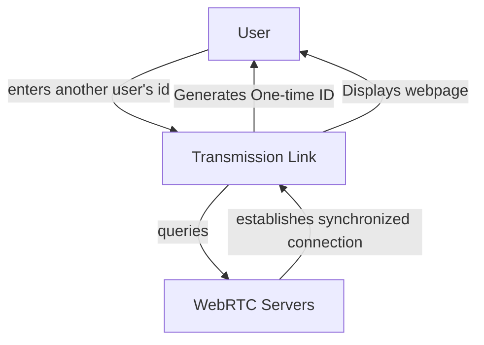

```mermaid
flowchart TB
	User["User"]
	App["Transmission Link"]
	WebRTC["WebRTC Servers"]

	App -->|Generates One-time ID| User
	App -->|Displays webpage| User
	
	User --> |enters another user's id| App
	App -->|queries| WebRTC
	WebRTC -->|establishes synchronized connection| App
```
